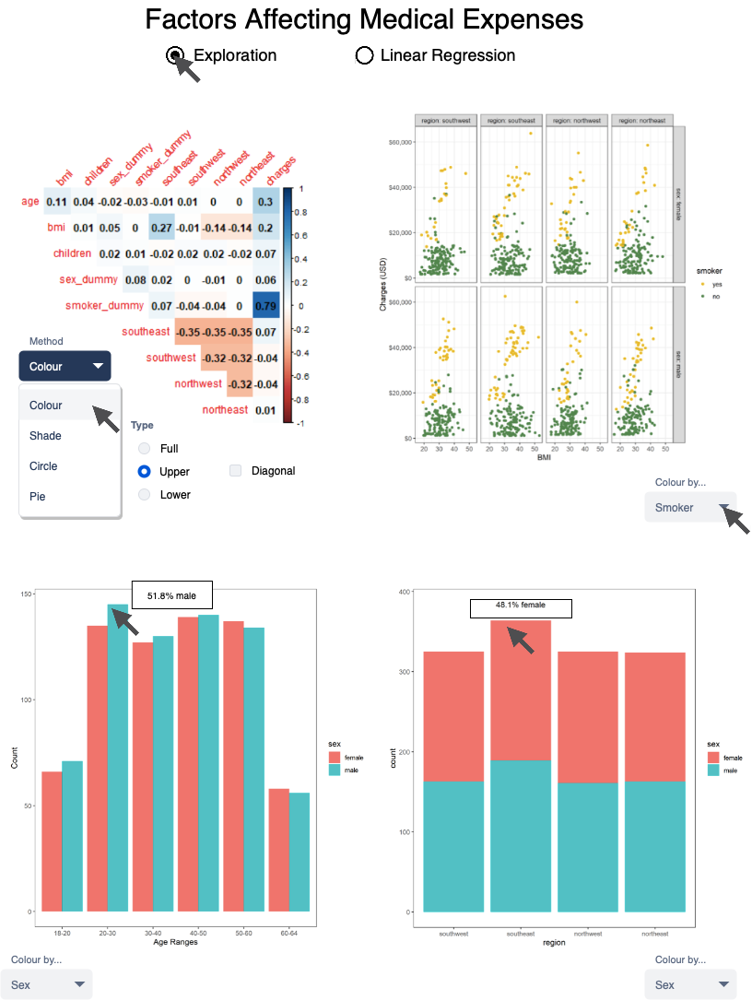
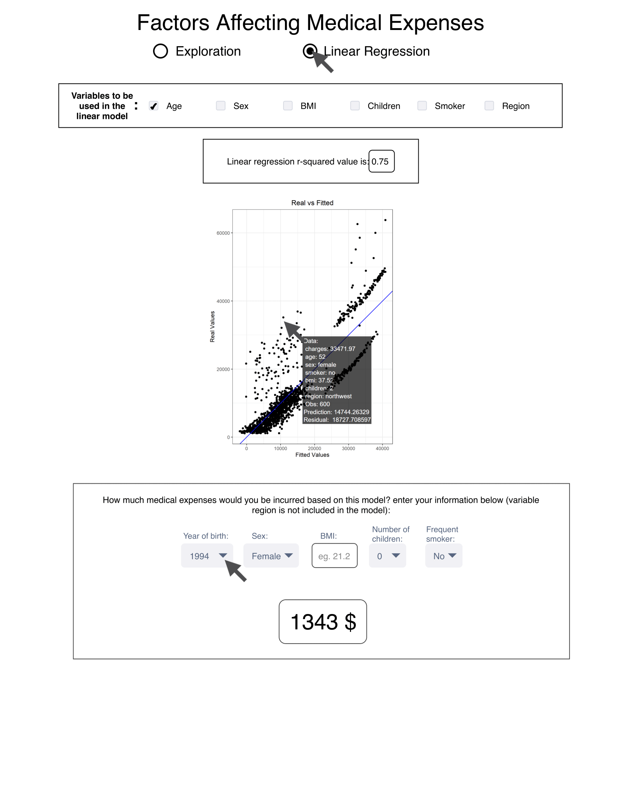

# Group 1: Factors Affecting Medical Expenses

## Table of Contents
1. [Introduction](#introduction)
1. [Usage](#usage)
    1. [Prerequisites](#prerequisites)
    1. [Running the whole pipeline](#running-the-whole-pipeline)
    1. [Running each step using the Makefile](#running-each-step-using-the-makefile)
    1. [Running each R script individually](#running-each-r-script-individually)
1. [Milestones](#milestones)
    1. [Milestone 1](#milestone-1)
    1. [Milestone 2](#milestone-2)
    1. [Milestone 3](#milestone-3)
    1. [Milestone 4](#milestone-4)
    1. [Milestone 5](#milestone-5)
    1. [Milestone 6](#milestone-6)
1. Final Report
    1. [HTML](https://stat547-ubc-2019-20.github.io/group_01_dlin_njamshidi/milestone3.html)
    1. [PDF](https://stat547-ubc-2019-20.github.io/group_01_dlin_njamshidi/milestone3.pdf)
    1. [Dashboard](https://stat547-group01-2020.herokuapp.com)
1. [Dashboard Proposal](#dashboard-proposal)
    1. [Description](#description)
    1. [Usage Scenario](#usage-scenario)
    1. [Sketch](#sketch)

## Introduction

This repository holds the STAT 547 Group Project, for Group 1: Diana Lin and Nima Jamshidi. The dataset we have chosen to work with is the "Medical Expenses" dataset used in the book [Machine Learning with R](https://www.amazon.com/Machine-Learning-R-Brett-Lantz/dp/1782162143), by Brett Lantz. This dataset was extracted from [Kaggle](https://www.kaggle.com/mirichoi0218/insurance/home) by Github user [\@meperezcuello](https://gist.github.com/meperezcuello). The information about this dataset has been extracted from their [GitHub Gist](https://gist.github.com/meperezcuello/82a9f1c1c473d6585e750ad2e3c05a41).

## Usage

### Prerequisites
1. Clone this repo
    ```
    git clone https://github.com/STAT547-UBC-2019-20/group_01_dlin_njamshidi.git
    ```

1. Ensure the following packages are installed:
    - `RCurl`
    - `base64enc`
    - `bookdown`
    - `broom`
    - `corrplot`
    - `crayon`
    - `dash`
    - `dashCoreComponents`
    - `dashDaq`
    - `dashHtmlComponents`
    - `dashTable`
    - `docopt`
    - `devtools`
    - `fiery`
    - `glue`
    - `grid`
    - `gridExtra`
    - `hablar`
    - `here`
    - `htmltools`
    - `knitr`
    - `mime`
    - `plotly`
    - `png`
    - `psych`
    - `rmarkdown`
    - `reqres`
    - `reshape2`
    - `routr`
    - `scales`
    - `testthat`
    - `tidyverse`: `ggplot2`, `dplyr`, `tidyr`, `readr`, `purrr`, `tibble`, `stringr`, `forcats`
    - `tinytex`
    - `viridis`
    
    To install all these packages:
    ```
    make install
    ```
    
### Running the whole pipeline

1. Clean the repository to undo any residual incomplete analysis
    ```
    make clean
    ```

1. Install all required packages:
    ```
    make install
    ```
  
1. Run the entire analysis pipeline
    ```
    make all
    ```
  
### Running each step using the Makefile

1. Download the data
    ```
    make data/raw/data.csv
    ```
1. Process the data
    ```
    make data/processed/processed_data.csv
    ```
1. Perform exploratory analysis
    ```
    make images/age_histogram.png images/corrplot.png images/facet.png images/region_barchart.png data/explore/correlation.rds
    ```
1. Perform linear regression
    ```
    make data/linear_model/model.rds data/linear_model/tidied.rds data/linear_model/glanced.rds data/linear_model/augmented.rds images/lmplot001.png images/lmplot002.png images/lmplot003.png images/lmplot004.png images/lmplot005.png
    ```
1. Knit the final report
    ```
    make docs/milestone3.html docs/milestone3.pdf
    ```
  
### Running each R script individually

1. Run the following scripts (in order) with the appropriate arguments specified
    1. Install required packages
        ```
        Rscript scripts/install.R
        ```
    1. Download the data
        ```
        Rscript scripts/load_data.R --data_to_url="https://gist.github.com/meperezcuello/82a9f1c1c473d6585e750ad2e3c05a41/raw/d42d226d0dd64e7f5395a0eec1b9190a10edbc03/Medical_Cost.csv"
        ```
    1. Wrangle/clean/process your data 
        ```
        Rscript scripts/process_data.R --file_path="data/raw/data.csv" --filename="processed_data.csv"
        ```
    1. Conduct exploratory data analysis
        ```
        Rscript scripts/explore_data.R --processed_data="data/processed/processed_data.csv" --path_to_images="images" --path_to_data="data/explore"
        ```
    1. Conduct linear regression
        ```
        Rscript scripts/linear_model.R --processed_data="data/processed/processed_data.csv" --path_to_images="images" --path_to_lmdata="data/linear_model"
        ```
    1. Knit the final report
        ```
        Rscript scripts/knit.R --finalreport="docs/milestone3.Rmd"
        ```

## Milestones

### Milestone 1

For Milestone 1, you can find our initial explorary data analysis in the link below:

https://stat547-ubc-2019-20.github.io/group_01_dlin_njamshidi/milestone1.html

Our progress is outlined in issue [#4](https://github.com/STAT547-UBC-2019-20/group_01_dlin_njamshidi/issues/4).

### Milestone 2

For Milestone 2, you can find the scripts to load, process, and conduct exploratory data analysis in the [`scripts/`](scripts/) directory. The first draft of our report can be found [here](https://stat547-ubc-2019-20.github.io/group_01_dlin_njamshidi/milestone2.html).

Our progress is outlined in issue [#8](https://github.com/STAT547-UBC-2019-20/group_01_dlin_njamshidi/issues/8).

1. `load_data.R`
    ```
    Rscript scripts/load_data.R --data_to_url=https://gist.github.com/meperezcuello/82a9f1c1c473d6585e750ad2e3c05a41/raw/d42d226d0dd64e7f5395a0eec1b9190a10edbc03/Medical_Cost.csv
    ```

1. `process_data.R`
    ```
    Rscript scripts/process_data.R --file_path="data/raw/data.csv" --filename="processed_data.csv"
    ```

1. `explore_data.R`
    ```
    Rscript scripts/explore_data.R --processed_data="data/processed/processed_data.csv" --path_to_images="images"
    ```

### Milestone 3

For Milestone 3, the script to knit the final report is [`scripts/knit.R`](scripts/knit.R). The final report can be here in [HTML](https://stat547-ubc-2019-20.github.io/group_01_dlin_njamshidi/milestone3.html) and [PDF](https://stat547-ubc-2019-20.github.io/group_01_dlin_njamshidi/milestone3.pdf).

Our progress is outlined in issue [#24](https://github.com/STAT547-UBC-2019-20/group_01_dlin_njamshidi/issues/24).

1. `linear_model.R`
    ```
    Rscript scripts/linear_model.R --processed_data="data/processed/processed_data.csv" --path_to_images="images" --path_to_lmdata="data/linear_model"
    ```
    
1. `knit.R`
    ```
    Rscript scripts/knit.R --finalreport="docs/milestone3.Rmd"
    ```
    
1. `Makefile`
    ```
    make
    ```

### Milestone 4

For Milestone 4, we have addressed the feedback from TAs (issues [#9](https://github.com/STAT547-UBC-2019-20/group_01_dlin_njamshidi/issues/9) and [#25](https://github.com/STAT547-UBC-2019-20/group_01_dlin_njamshidi/issues/25)), and from our peers (issues [#35](https://github.com/STAT547-UBC-2019-20/group_01_dlin_njamshidi/issues/35) and [#39](https://github.com/STAT547-UBC-2019-20/group_01_dlin_njamshidi/issues/39)). Of the feedback in these four issues, all were implemented except for one, which has been filed under future work in issue [#41](https://github.com/STAT547-UBC-2019-20/group_01_dlin_njamshidi/issues/41).

Our progress is outlined in issue [#40](https://github.com/STAT547-UBC-2019-20/group_01_dlin_njamshidi/issues/40).

### Milestone 5
For milestone 5, we have finished our dashboard in [`app.R`](app.R), and implemented TA feedback from issue [#46](https://github.com/STAT547-UBC-2019-20/group_01_dlin_njamshidi/issues/46)

Our progress is outlined in issue [#44](https://github.com/STAT547-UBC-2019-20/group_01_dlin_njamshidi/issues/44).

To run the dashboard locally:

```
Rscript app.R
```

### Milestone 6
For milestone 6, we have implemented the TA feedback from issue [#54](https://github.com/STAT547-UBC-2019-20/group_01_dlin_njamshidi/issues/54).

Our progress is outlined in issue [#52](https://github.com/STAT547-UBC-2019-20/group_01_dlin_njamshidi/issues/52).

To access our dashboard deployed on Heroku, click [here](https://stat547-group01-2020.herokuapp.com)!

## Dashboard Proposal

### Description
This app has two main pages. The user can choose between an exploration page or a page which shows the results of linear regression conducted on the dataset. On the first page, the user can find 4 graphs, each of which showing some statistics regarding the dataset. The upper left graph shows the correlations between dataset factors. The user can choose between color, shade, circle or pie as the style that is going to be used in the graph to display the correlations. Since the correlation matrix is symmetrical, the user can change the appearance of the graph to be a full, upper, or lower triangular matrix plus the option to hide diagonal values (equal to 1). Next to this graph, is a faceted plot that shows how BMI and charges are distributed for each region and sex. The user can choose a factor between smoker, age, and children to be represented in colors to make the most out of this graph. The left and right graphs at the bottom of the page show the distribution of the data among the age groups and regions respectively. They are color-coded based on the sex, smoker, or children factors chosen by the user.
On the second page, at the top of the page the user can choose the factors they want to be used in the linear regression and see the results below it. The r-squared value and the diagnostics graphs would be shown there. At the bottom of this page, the user can enter their information required for each factor to see how much the linear regression model would estimate their medical charges.

### Usage Scenario
Ron is taking The fundamentals of Public Health Care as an undergraduate course. As an assignment, he needs to estimate the medical expenses his group of classmates has. He should send a form to his classmates asking for information; however, he is not sure what information to request from them. He logs in the Medical Expenses app to learn more about the factors affecting medical expenses. He can look at the visualizations on the exploration page and grasp an idea of what the dataset looks like. He can learn about the correlation between the factors included in the dataset. He can look at the distribution of the dataset among various variables on this page. He might want to check if different sex would have visually distinctive clusters in the BMI vs. charges graph. He can look at the bar charts to see what type of distribution do the factors follow in this dataset. Next, he can go to the linear regression page and play with the factors to find which combination of factors can better explain the charges. In the end, he can put his own information, to check if the regression model based on the available variables can estimate his expenses well or not. He might decide to include some of the variables in this dataset and add other variables such as occupation, health status of parents and etc. in his form. 

### Sketch

***

