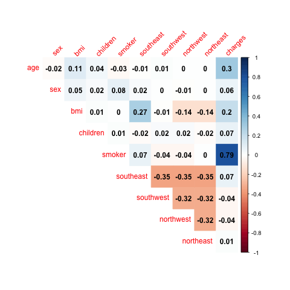
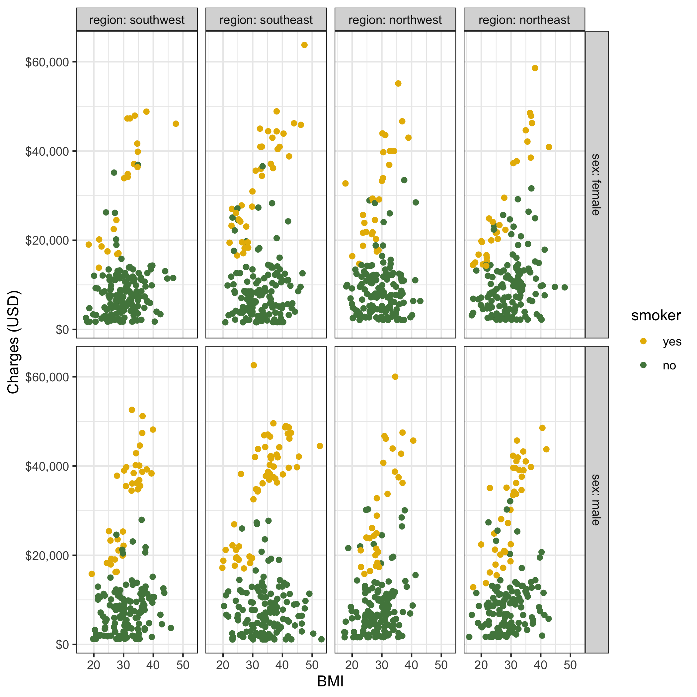
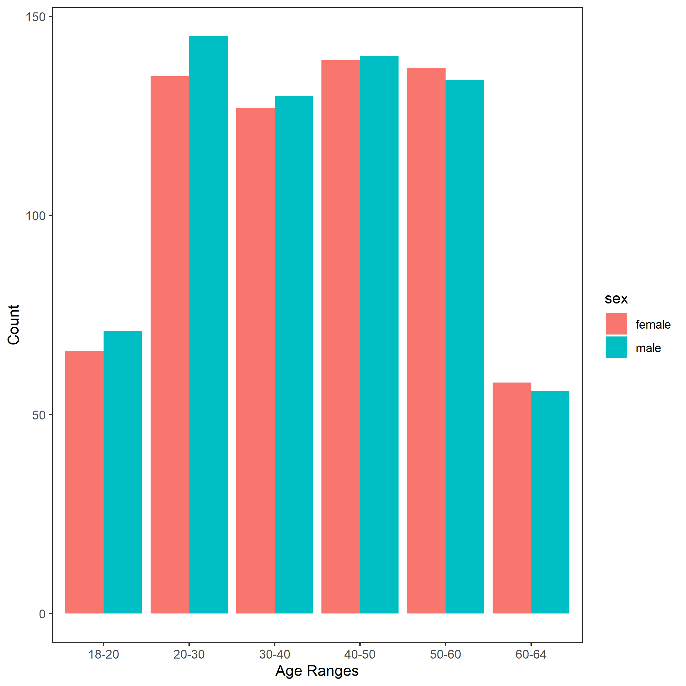
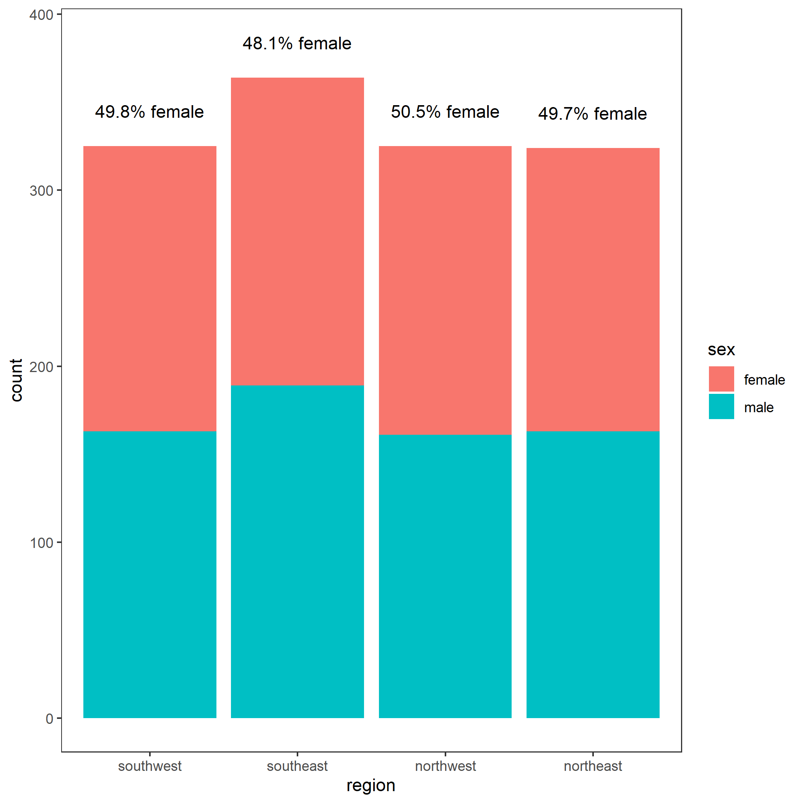

```{r setup, include=FALSE}
knitr::opts_chunk$set(echo = TRUE)
```

```{r load, echo = FALSE, message = FALSE, warning = FALSE}
library(tidyverse)
library(here)
library(corrplot)
library(scales)
library(glue)
library(psych)
library(hablar)
```

## Introduction

The dataset we have chosen to work with is the "Medical Expenses" dataset used in the book [Machine Learning with R](https://www.amazon.com/Machine-Learning-R-Brett-Lantz/dp/1782162143), by Brett Lantz. This dataset was extracted from [Kaggle](https://www.kaggle.com/mirichoi0218/insurance/home) by Github user [\@meperezcuello](https://gist.github.com/meperezcuello). The information about this dataset has been extracted from their [GitHub Gist](https://gist.github.com/meperezcuello/82a9f1c1c473d6585e750ad2e3c05a41).

This dataset is very interesting as the USA does not have universal healthcare, and is known for bankrupting its citizens with hospital visits despite having insurance. It will be interesting to see the relationship between characteristics of a beneficiary, such as `BMI` and `Smoking` status, and the `charges` incurred.

Originally, this dataset was used to train a machine learning algorithm to accurately predict insurance costs using linear regression.

## Data Description

This dataset explains the medical insurance costs of a small sample of the USA population. Each row corresponds to a beneficiary. Various metadata was recorded as well.

```{r load the data}
# import the data 
costs <- read_csv(
  here("data", "raw", "Medical_Cost.csv"),
  col_types = cols(
    age = col_integer(),
    sex = readr::col_factor(),
    bmi = col_double(),
    children = col_integer(),
    smoker = readr::col_factor(),
    region = readr::col_factor(),
    charges = col_double()
  )
)
```

The columns (except the last one) in this dataset correspond to metadata, where the last column is the monetary charges of medical insurance:
```{r columns}
colnames(costs)
```

Here are the possible values for each of the above column names:

Variable | Type | Description
---------|------|---------------
Age | integer | the primary beneficiary's age in years
Sex | factor | the beneficiary's sex: `female` or `male`
BMI | double | the beneficiary's Body Mass Index, a measure of their body fat based on height and weight (measured in kg/m<sup>2</sup>), an ideal range of 18.5 to 24.9
Children | integer | the number of dependents on the primary beneficiary's insurance policy
Smoker | factor | whether or not the beneficiary is a smoker: `yes` or `no`
Region | factor | the beneficiary's residential area in the USA: `southwest`, `southeast`, `northwest`, or `northeast`
Charges | double | the monetary charges the beneficiary was billed by health insurance

## Exploring the Dataset

Here is a summary of the dataset, and the values of each variable:
```{r summary}
summary(costs)
```

### Correlogram

In this section we are inspecting the data set to see if there is any correlation between the variables. From now on we want to consider charges as our dependent variable.
In order to analyze correlation between variables, the ones that are categorical with two categories, are translated into binery vectors. The only categorical variable with more than two categories, is region. We split this variable into four different binery vectors, each indicating if the sample data has category (1) or not (0).
After using dummy variables for sex, smoker, and region, according to the correlogram below, smoker and charges has the strongest correlation of 0.79. No high collinearity between independent variables is observed.



### Faceted Plot

Here we want to explore the data to see if there is any cluster of data points. While the data between regions and sex does not appear to vary much, the smokers vs nonsmokers of each facet appear to cluster together, with the non-smokers having an overall lower medical cost.



### Histogram

How is the distribution of sex among different age groups?
Looking at the dataset, there appears to be more beneficiaries in the 20-60 age range. The biggest difference in the number of beneficiaries from different sex is seen in the 20-30 bracket.



### Stacked Bar Chart

How about the distribution of sex among the regions?
This plot shows the distribution of sex in each of the four regions. At a glance, the dataset looks very even when it comes to sex, but there are slightly more beneficiaries in the southeast.



## Methods

```{r methods}
# PLACE HOLDER FOR LINEAR REGRESSION
```

## Results

```{r results}
# PLACE HOLDER FOR LINEAR REGRESSION
```

## Discussion

```{r discussion}
# PLACE HOLDER FOR LINEAR REGRESSION
```

## Conclusion

```{r conclusion}
# PLACE HOLDER FOR LINEAR REGRESSION
```